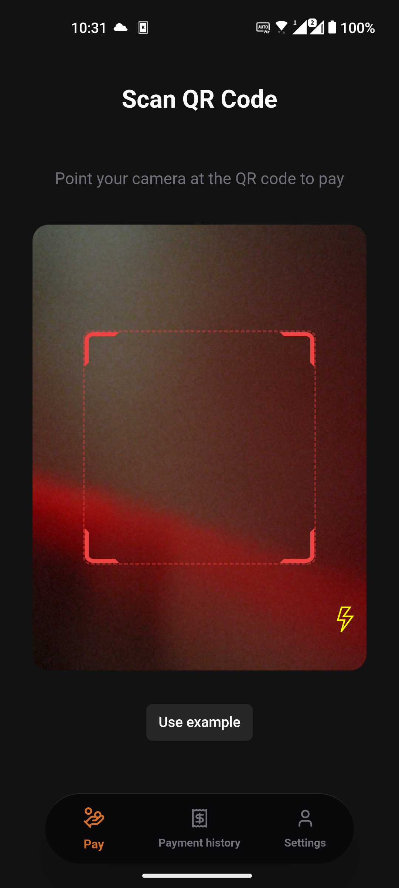
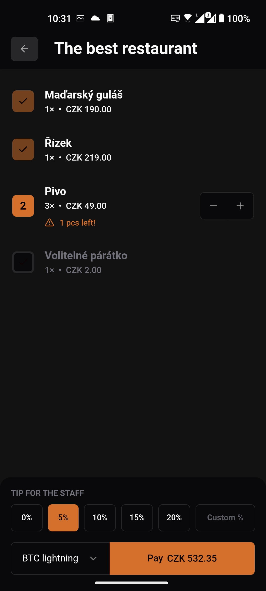
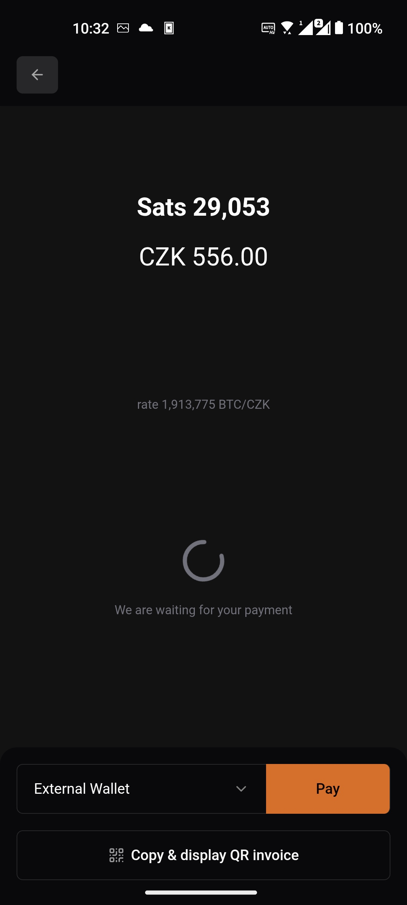

# Finito

> **Make business payments self-custody again**

Payments in both the online and real worlds are becoming increasingly digitized.
While digital payments offer convenience on one side, they also introduce numerous risks, issues, costs, technical limitations, and dependencies on third parties on the other.

Finito aims to restore control over payments to merchants, just like with physical cash.
It reduces reliance on banks, payment terminal providers, and "smart payment" services (e.g., pay-at-table, ordering, reservations, etc.).
Using the Finito app, you can start accepting payments in under a minute—whether you're running a café, bistro, restaurant, hair salon, plumbing service, or simply selling handmade goods.

Finito is a fully free and open-source project. Anyone can use it at no cost, and anyone can contribute to its development.
The code is transparent, allowing verification that it does exactly what it claims.

With Finito, your data remains under your sole control. No one else has access.
Data loss isn't a concern thanks to automated encrypted backups to relays of your choice—readable only by you.

## How Finito Works

Finito consists of two core components:

1. **Customer App** – Gives customers visibility into transactions (account overview, invoice preview, ordering, product catalog, payment history, etc.).
2. **Merchant App** – Allows merchants to manage items, sales, invoices, account balances, and more.

No company operates Finito. It runs locally on your device, storing encrypted data on Nostr (currently).
Data recovery requires only your seed phrase (similar to Bitcoin) and the Nostr relay addresses used for backups.

Communication between the customer and merchant apps is handled via the Nostr protocol.

### Merchant App Features

- **Point of Sale**: Manage open bills, assign them to tables, and initiate payments.
- **One-Time Payments**: Create standalone payments quickly.
- **Item Management**: Pre-define products/services for easy addition to bills or invoices.
- **Table Management**: Link open bills to specific tables.
- **Invoicing**: Currently supports Czech Republic (non-VAT payers, issued invoices only).
- **Contact Management**: Streamlines invoice creation.
- **Account Management**: Track funds across cash registers, bank accounts, BTC wallets, etc.

### Customer App Features

- **Payments**: Scan a QR code to select the appropriate plugin and complete payment (commonly table or bill QR codes from Finito POS).
- **Refunds**: Merchants can trigger refunds, guiding customers through the process.
- **Payment History**: View past transactions with details, items, and receipts.
- **Wallet Linking**: Connect external BTC wallets for use during payments.

## Supported Payment Methods

- **Bitcoin Payments**: Instant setup; connect wallets via NWC protocols or APIs.
- **Cash Payments**: Immediate, but no remote capability.
- **Bank QR Code Payments**: Works after entering account details; receipt verification/refunds need compatible bank plugins.
- **Card Payments**: Not currently supported due to technical constraints (future TapToPay possible).

## FAQ

**Is Finito truly free?**
Yes.

**Is using Finito legal?**
It should comply with Czech legislation. Consult your accountant for your specific case. Finito assumes no liability.

**Is Finito ready for production use?**
No—it's in an early experimental stage. It may work for basic needs, but prepare a backup plan in case of issues.
