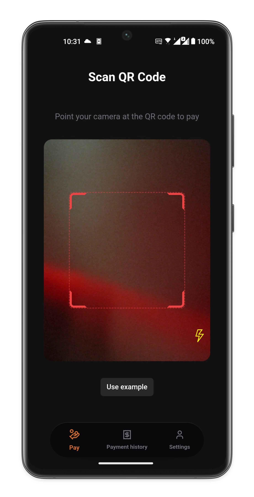
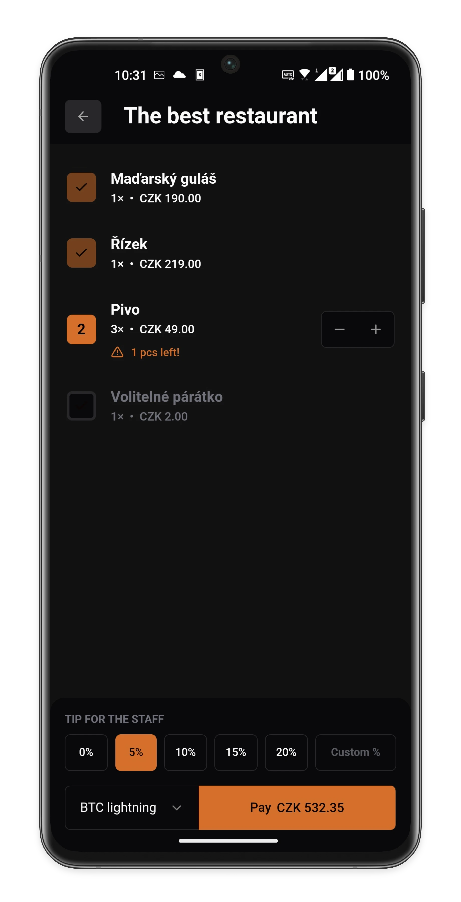
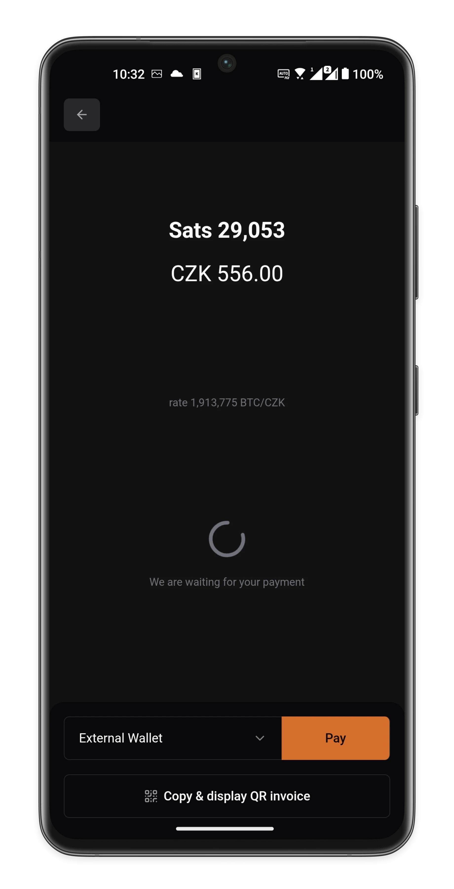
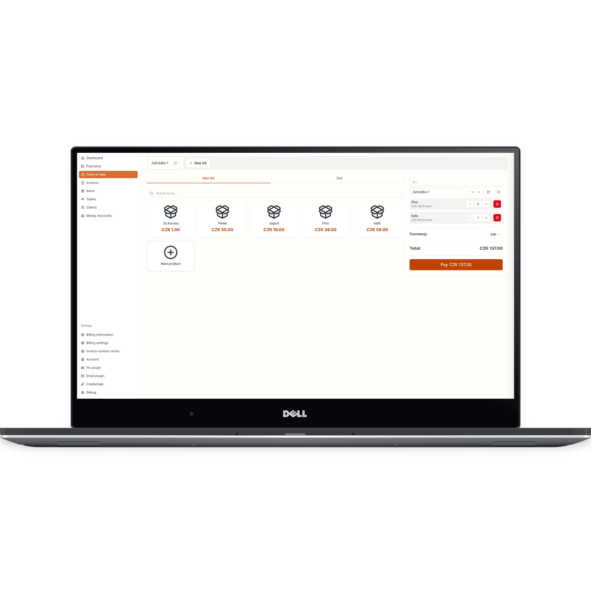

# Finito
### Make business payments self-custody again

> Finito is an open-source project under active development. APIs, UI, and data model may change.

<p>
  
  
  
</p>

Finito is a local-first payments platform for small businesses. The goal is simple: keep control over your data, your payment flow, and reduce dependency on third parties.

## Our Goal

Payment systems are becoming increasingly centralized, regulated, and dependent on closed providers. For many small businesses, this means rising costs, reduced flexibility, and weaker control over critical operational data.

Finito exists to offer a practical alternative:

- independent by default,
- open-source and auditable,
- simple enough for daily business use,
- modern enough to support real digital payment workflows.

We believe accepting payments should feel more like handling cash: direct, transparent, and under the merchant's control.

## Why Finito

- You own your business data and payment records.
- The system is local-first, so your core workflow does not rely on a single central operator.
- Integrations are composable, so payment methods can evolve without replacing the whole product.
- The codebase is open for inspection, contribution, and long-term community maintenance.

## What the project includes today

- Merchant/admin app (`app/admin/...`) for managing:
  - items, categories, clients, tables, and reservations,
  - payments, invoices, POS workflows, and reservation operations.
- Client app (`app/(client)/...`) for:
  - receiving and confirming payments,
  - payment history and basic settings.
- Local-first data layer powered by Evolu:
  - data is primarily local,
  - sync uses configurable transports (currently Nostr relay model).
- Desktop wrapper via Tauri (`src-tauri/`).

<p>
  
</p>

## Tech Stack

- Next.js (App Router), React, TypeScript
- Bun (runtime + scripts)
- Jotai (state), Evolu (DB/sync), TanStack Query
- Tailwind + Radix UI components
- Nostr integration (`@nostr-dev-kit/ndk`)
- Tauri 2 (desktop build)

## Quick Start (Development)

### 1) Requirements

- `bun` (latest stable recommended)
- Node.js (for some ecosystem tooling)
- Optional: Rust + Tauri toolchain for desktop builds

### 2) Install

```bash
bun install
```

### 3) Run the web app

```bash
bun run dev
```

### 4) Quality checks

```bash
bun run check:lint
bun run check:types
bun run check:tests
```

Or run everything at once:

```bash
bun run check
```

## Build

```bash
bun run build
```

You can serve the static output locally:

```bash
bun run start
```

## Repository Structure

- `app/` routes and UI flows (merchant + client)
- `components/` shared UI/feature components
- `atoms/` Jotai atoms (account/evolu bootstrap)
- `hooks/` hooks for queries, UI state, and integrations
- `lib/` domain utilities, Evolu schema, messaging
- `src-tauri/` desktop layer (Rust)
- `scripts/` helper scripts

## Architecture

Detailed architecture documentation:

- [`ARCHITECTURE.md`](ARCHITECTURE.md)

It covers:
- codebase map for fast navigation,
- data flow (app Evolu vs. device Evolu),
- `DataTable` + cursor pagination rules,
- guardrails for safe changes.

## Project Status

- The project is experimental, but already useful for development and real-world testing.
- Treat the current implementation as evolving, not a finalized production standard.
- If you deploy it in production-like contexts, keep a fallback plan.

## FAQ

**Is Finito free to use?**  
Yes. Finito is open-source and free to use.

**Is it production-ready for all businesses?**  
Not yet. It is evolving quickly and should be adopted with operational caution.

**Who operates Finito?**  
No single company operates it as a centralized payment processor. It is software you run and control.

## Contributing

PRs are welcome. For larger changes, open an issue or draft PR first to align on direction.

## License

[MIT](LICENSE)
